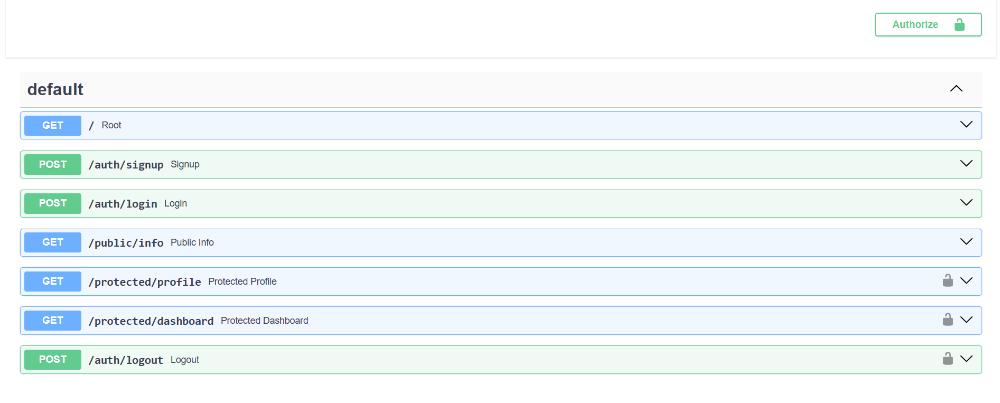

# Secure Authentication API (FastAPI & Supabase)

A secure backend API built with **Python**, **FastAPI**, and **Supabase**. This project implements user registration, credential-based login, session termination (logout), and route protection using JSON Web Tokens (JWTs) verified through Supabase as the Identity Provider (IdP).

---

## Features
* Secure Sign Up and Log In via Supabase Auth.
* Custom middleware dependency utilizing Supabase SDK to validate bearer tokens.
* Clear separation between open endpoints and guarded resources.
* Automatically generated Swagger UI at `/docs` with integrated Bearer Token authorization.

---

## Local Setup & Installation

### 1. Clone the Repository
### 2. Create a python virtual enviorment with `python -m venv venv && venv\Scripts\activate`
### 3. Run `pip install fastapi uvicorn supabase pydantic pydantic[email] python-dotenv email-validator`
### 4. Add your supabase keys in an .env file
### 5. Start the app with `uvicorn main:app --reload --port 3000`

## API Reference

| Endpoint | Method | Description | Authentication Required | Status Codes |
| :--- | :--- | :--- | :--- | :--- |
| `/auth/signup` | `POST` | Register a new user account | None | `201`, `400` |
| `/auth/login` | `POST` | Authenticate user & return JWT tokens | None | `200`, `401` |
| `/auth/logout` | `POST` | Terminate current user session | Bearer Token | `204`, `401` |
| `/public/info` | `GET` | Read public, unprotected data | None | `200` |
| `/protected/profile` | `GET` | Read private user profile metadata | Bearer Token | `200`, `401` |
| `/protected/dashboard` | `GET` | Access secure user dashboard | Bearer Token | `200`, `401` |