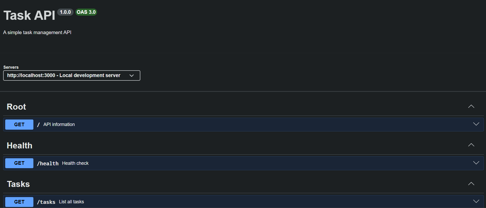
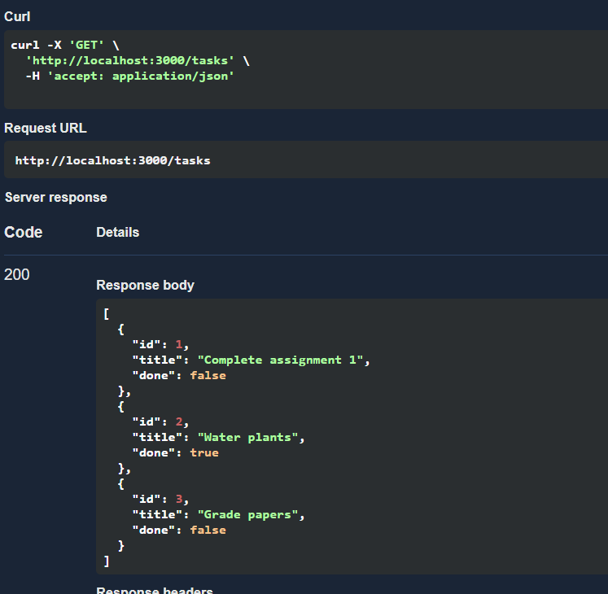

# To Do Api
A simple CRUD Api to help manage tasks to do. Built with express.

## How to Run
1. Clone the repository
2. Run `npn install` to install dependacies in terminal
3. Run `node app.js` to run app
4. Access api at `http://localhost:3000`

## Endpoints
| Method | Path | Description |
|---|---|---|
| GET | / | API info |
| GET | /health | Health check |
| GET | /tasks | List all tasks |
| GET | /tasks/:id | Lists a task |
| POST | /tasks | Create a task |
| PUT | /tasks/:id | Update a task |
| DELETE | /tasks/:id | Remove a task |

## Swagger UI
You can view the interactive documentation at `/docs`

